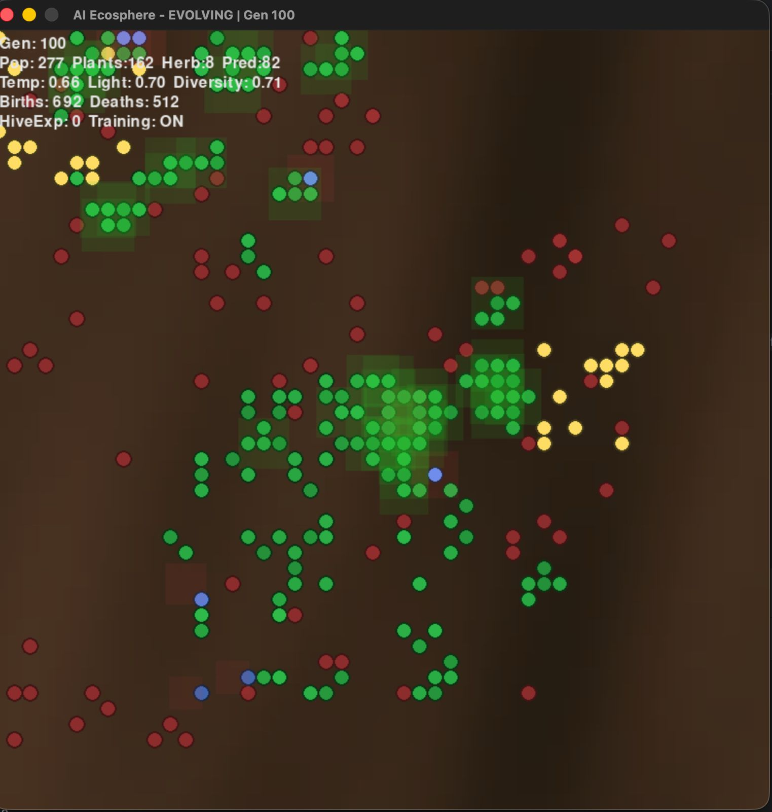

# 🌍 **Evolving AI Biosphere**
### A living digital world where AI organisms evolve and adapt through memory, learning, and survival.

---

## 📚 Table of Contents
1. [🧠 Overview](#-overview)  
2. [🖼️ Demo Snapshot](#-demo-snapshot)  
3. [🧬 Species Overview](#-species-overview)  
   - [🌱 Plants (Green)](#-plants-green)  
   - [🐇 Herbivores (Blue)](#-herbivores-blue)  
   - [🦊 Predators (Red)](#-predators-red)  
4. [🌦️ Environment Dynamics](#️-environment-dynamics)  
5. [⚙️ Energy Flow](#️-energy-flow)  
6. [🧪 Scent Diffusion System](#-scent-diffusion-system)  
7. [🧭 Emergent Phenomena](#-emergent-phenomena)  
8. [🧬 Reproduction & Inheritance](#-reproduction--inheritance)  
9. [💀 Death & Decay](#-death--decay)  
10. [🕹️ Interactive Controls](#️-interactive-controls)  
11. [🎨 Visual Feedback](#-visual-feedback)  
12. [📊 Long-Term Dynamics](#-long-term-dynamics)  
13. [⚙️ Installation & Setup](#️-installation--setup)  
14. [▶️ Running the Simulation](#️-running-the-simulation)  
15. [🌋 Test Ecosystem Resilience](#-test-ecosystem-resilience)  
16. [🧠 Study Hive Learning](#-study-hive-learning)  
17. [🧩 Custom Scenarios](#-custom-scenarios)  
18. [📈 Reporting](#-reporting)  
19. [🌍 Summary](#-summary)

---

## 🧠 Overview

**Evolving AI Biosphere** (formerly *AI Ecosphere*) is a **self-evolving artificial life simulation** where three species — **plants**, **herbivores**, and **predators** — interact in a dynamic, learning-based ecosystem.

Unlike static simulations, organisms here use **neural networks** and **reinforcement learning** to evolve **emergent behaviors** — adapting, learning, and surviving across generations.

> A digital petri dish where **machine learning meets natural selection**.

🧩 **Technical Documentation:**  
Basically, how it all comes together — visit the full docs at  
👉 [https://alwaysvivek.github.io/evolving-ai-biosphere/](https://alwaysvivek.github.io/evolving-ai-biosphere/)

---

## 🖼️ Demo Snapshot

Generation 100 — stabilized biosphere (plant dominance phase):

<p align="center">
  
</p>

> **Description:**  
> A dynamic view of the AI Ecosphere at Generation 100. The dark, textured terrain is populated by three species: **Plants (Green)**, **Predators (Red)**, and sparse **Herbivores (Blue)**, alongside **Nutrient Deposits (Yellow)**.  
> Notice the emergence of distinct territories: a dense central *Plant Forest* protected by clustered, actively hunting predators, and areas of high *Plant Scent* (green halos) indicating concentrated resources.  
> The top-left overlay confirms the critical environmental balance: a **high population (277)** but a **low, yet stable, Diversity Score (0.71)**.


📄 **View raw simulation log:**  
[logs/sample_output.txt](logs/sample_output.txt)

---

## 🧬 Species Overview

### 🌱 **Plants (Green)**
Sessile organisms that generate energy via photosynthesis and reproduce asexually when conditions allow.

**Life Cycle:**
- Gain energy from light; reproduce at **130+ energy** (splitting energy with offspring)
- Die from **old age (350+ cycles)**, **overcrowding**, **low light**, or **herbivore consumption**
- Emit **scent** signals to attract herbivores

**Key Stats:**
- Max Energy: 150  
- Photosynthesis: +3.5 energy/cycle  
- Metabolism: -0.4 energy/cycle  
- Death in low light (< 0.18 intensity)

---

### 🐇 **Herbivores (Blue)**
Mobile agents that eat plants and flee predators using their own **LSTM neural networks**.

**Behavior Systems:**
- **Foraging:** Seek plant-rich areas via scent gradients  
- **Predator Avoidance:** Escape zones with predator presence  
- **Energy Management:** Balance eating, resting, and reproducing  
- **Reproduction:** At **90+ energy** (with mutated neural weights)

**LSTM Inputs (8):**
1. Nearby plant count  
2. Herbivore count  
3. Predator count  
4. Nutrient count  
5. Energy level  
6. Age factor  
7–8. Random noise (exploration)

**Outputs:** Reproduce, move/hunt, rest, or idle.

---

### 🦊 **Predators (Red)**
Apex hunters governed by a **collective LSTM Hive Mind** — all predators share one evolving neural brain.

**Life Cycle:**
- Feed on herbivores (+120 energy per kill)
- Reproduce at **100+ energy**
- Die from starvation or old age (600+ cycles)

**Hive Mind Learning:**
- All predators share experiences (observations, rewards, actions)
- Every 20 generations, the **Hive trains via REINFORCE**
- Collective intelligence leads to evolved group strategies (e.g., flanking, trapping prey)

---

## 🌦️ Environment Dynamics

### 🔆 **Spatial Light Field**
- Varies across the map (bright → plant-rich, dark → barren)
- Affects plant growth and energy efficiency

### 🌡️ **Temperature**
- Fluctuates between 0.0–1.0  
- Alters metabolism and photosynthesis efficiency

### 🌘 **Global Light Cycle**
- Varies between 0.3–1.0 to simulate day/night cycles

### 🪨 **Nutrient Spawning**
- Random nutrient deposits boost local ecosystem growth

---

## ⚙️ Energy Flow

Energy drives survival — all species gain and spend it differently:

| Flow | Source → Target | Description |
|------|-----------------|--------------|
| ☀️ | Light → Plants | Photosynthesis |
| 🌿 | Plants → Herbivores | Foraging |
| 🩸 | Herbivores → Predators | Hunting |
| 🔥 | All | Metabolism & movement drain |

**Balance:**  
Overgrowth in one level causes cascading effects — predator crashes, herbivore booms, plant depletion, etc.

---

## 🧪 Scent Diffusion System

Chemical scent fields create **indirect perception**:

| Scent Type | Emitted By | Function |
|-------------|-------------|-----------|
| 🌿 **Plant Scent** | Plants | Attracts herbivores |
| 🐾 **Herbivore Scent** | Herbivores | Attracts predators |

Each scent diffuses outward over 3 steps, creating **gradient maps** for navigation.

---

## 🧭 Emergent Phenomena

The AI-driven evolution leads to realistic ecological dynamics:

- **Boom–Bust Cycles:** Natural oscillations in population sizes  
- **Spatial Clustering:** Territory and colony formation  
- **Behavioral Evolution:** Learned evasion and hunting strategies  
- **Extinction Events:** Permanent loss of species reshapes balance  
- **Monoculture Dominance:** Single-species takeovers causing fragility  

---

## 🧬 Reproduction & Inheritance

| Species | Inheritance Type | Mutation |
|----------|------------------|-----------|
| 🌱 Plants | Asexual cloning | None |
| 🐇 Herbivores | Neural weight mutation | ±0.01 (2% chance) |
| 🦊 Predators | Hive-mind training | Collective evolution |

---

## 💀 Death & Decay

| Cause | Description |
|--------|--------------|
| Starvation | Energy depletion |
| Old Age | Beyond max lifespan |
| Predation | Eaten by higher species |
| Overcrowding | Excess neighbors (plants) |
| Light Starvation | Insufficient local light |
| Random Events | Manual extinction events |

---

## 🕹️ Interactive Controls

| Key | Action |
|-----|--------|
| **SPACE** | Play/Pause simulation |
| **C** | Clear all organisms |
| **R** | Generate statistical report |
| **A** | Generate ML-powered analytics report |
| **X** | Export data to CSV |
| **T** | Toggle Hive training |
| **F** | Spawn flower pattern |
| **S** | Spawn spiral formation |
| **O** | Predator swarm |
| **N** | Nutrient field |
| **K** | Kill all predators |
| **L** | Kill all herbivores |
| **P** | Kill all plants |
| **E** | Scarcity event |
| **Q** | Quit simulation |

---

## 📊 ML-Powered Analytics

The simulation now includes comprehensive **machine learning analytics** using **Pandas** and **Scikit-learn**:

### Features:
- **Time-Series Analysis**: Track population dynamics, diversity scores, and environmental conditions across generations
- **Statistical Metrics**: Comprehensive summary statistics including means, correlations, and variance
- **Behavior Clustering**: K-means clustering to identify distinct organism behavior patterns
- **Population Trend Analysis**: Detect boom-bust cycles and population trends
- **Crash Prediction**: Linear regression to predict population crashes before they occur
- **Data Export**: Export all collected data to CSV for external analysis
- **🆕 Vector Database**: FAISS-powered behavior embedding similarity search for finding similar behaviors
- **🆕 Transformer Attention**: Attention-based organism decision models as alternative to LSTM
- **🆕 RAGAS-Style Evaluation**: Automated ecosystem quality evaluation with health, diversity, stability, behavioral quality, and resilience scores

### Usage:
1. Press **A** during simulation to generate a comprehensive analytics report (or wait for auto-report every 20 generations)
2. Press **X** to export all data to CSV files in the `analytics_output/` directory
3. Data is automatically logged every 5 generations for efficiency
4. **🆕 Analytics reports are now AUTO-GENERATED every 20 generations!** No need to press 'A' anymore.

### What's Analyzed:
- **Species populations** over time (plants, herbivores, predators)
- **Diversity metrics** (Shannon entropy)
- **Environmental conditions** (temperature, light)
- **Behavior patterns** (actions, energy levels, rewards)
- **Population correlations** between species
- **Extinction events** and their impacts
- **🆕 Behavior embeddings** stored in vector database for similarity search
- **🆕 Ecosystem quality scores** using RAGAS-style automated evaluation

### Example Output:
```
ECOSYSTEM ANALYTICS REPORT
================================================================================
### SUMMARY STATISTICS ###
Total Generations: 100
Population - Max: 350, Avg: 287.5, Min: 45
Average Diversity Score: 0.823

### POPULATION TRENDS ###
Plants: stable
Herbivores: decreasing
Predators: increasing

### BEHAVIOR CLUSTERING ###
Total Behaviors Analyzed: 1543
Silhouette Score: 0.641
Cluster 0: Size=512, Type=Predator, Action=Hunt/Eat, AvgEnergy=85.3

### POPULATION CRASH PREDICTIONS ###
Herbivores: ⚠️ CRASH LIKELY
  Current: 45, Predicted: 12.3, Trend: -2.15/gen

### VECTOR DATABASE STATISTICS ###
Total Behaviors Stored: 1543
Embedding Dimension: 128
FAISS Enabled: Yes

### BEHAVIOR SIMILARITY SEARCH ###
Query: Predator - Hunt/Eat (Energy: 85.3)
  Similar 1 (dist=0.002): Predator - Hunt/Eat (Energy: 87.1, Age: 45, Reward: 12.00)
  Similar 2 (dist=0.005): Predator - Hunt/Eat (Energy: 83.2, Age: 52, Reward: 10.50)

### AUTOMATED ECOSYSTEM EVALUATION ###
Overall Score: 72.5/100 (C)
  Health:             85.2/100
  Diversity:          82.3/100
  Stability:          65.1/100
  Behavioral Quality: 68.4/100
  Resilience:         61.5/100
```

### New AI Features:

#### 🔍 Vector Database for Behavior Similarity
The system now uses **FAISS** (Facebook AI Similarity Search) to store behavior embeddings and perform fast similarity searches. This allows you to find organisms with similar behaviors based on their actions, energy levels, age, and rewards.

#### 🤖 Transformer Attention Models
Organisms can now use **Transformer-based attention mechanisms** instead of just LSTM for decision-making. The transformer model:
- Uses multi-head attention to focus on relevant features
- Implements residual connections and layer normalization
- Provides an alternative to traditional recurrent networks
- Enabled by default for all new organisms (`use_transformer_models = True`)

#### 📊 RAGAS-Style Automated Evaluation
Inspired by RAGAS (Retrieval-Augmented Generation Assessment), the system now includes automated quality evaluation with five key metrics:

1. **Health Score (0-100)**: Population balance and energy flow
2. **Diversity Score (0-100)**: Species variety (Shannon entropy)
3. **Stability Score (0-100)**: Low population variance = high stability
4. **Behavioral Quality Score (0-100)**: Reward efficiency and energy management
5. **Resilience Score (0-100)**: Recovery from disturbances and extinctions

The overall score is a weighted average that provides a comprehensive ecosystem quality assessment.

---

## 🎨 Visual Feedback

- **Colors:** Green=Plant, Blue=Herbivore, Red=Predator  
- **Brightness:** Indicates energy level  
- **Scent Halos:** Faint green/red glows show chemical concentrations  
- **Background:** Noise-based soil texture that shifts with temperature and light  
- **HUD Overlay:** Displays population stats, generation count, diversity, temperature, and hive experience

---

## 📊 Long-Term Dynamics

| Phase | Description |
|--------|-------------|
| **0–50 generations** | Unstable bursts and population crashes |
| **50–200 generations** | Evolved equilibrium and specialization |
| **200+ generations** | Stable biomes, learned behaviors, and possible extinctions |

> Each major extinction or scarcity event permanently alters ecosystem balance.

---

## ⚙️ Installation & Setup

### ✅ **Prerequisites**
- Python 3.7+  
- Basic GPU/CPU for 800×800 rendering (30 FPS)  

### 🛠️ **Technology Stack**

This project demonstrates proficiency in:
- **Python** - Core programming language
- **PyTorch** - Deep learning framework for LSTM and Transformer networks
- **NumPy** - Numerical computing and array operations
- **Pandas** - Data analysis and time-series logging
- **Scikit-learn** - ML algorithms (K-means clustering, linear regression)
- **Pygame** - Real-time visualization and interaction
- **🆕 FAISS** - Fast similarity search and clustering of dense vectors
- **🆕 Sentence Transformers** - State-of-the-art text/behavior embeddings (optional)

**Machine Learning Techniques:**
- LSTM Neural Networks for organism decision-making
- **🆕 Transformer Models with Multi-Head Attention** for advanced organism decisions
- REINFORCE (Policy Gradient) for predator hive training
- K-means Clustering for behavior pattern identification
- Linear Regression for population crash prediction
- **🆕 Vector Embeddings** for behavior similarity search
- Statistical analysis and model evaluation metrics
- **🆕 RAGAS-style Automated Evaluation** for ecosystem quality assessment

---

### 📦 **Installation**

1. **Clone or Download Repository**
   ```bash
   git clone https://github.com/<your-username>/evolving-ai-biosphere.git
   cd evolving-ai-biosphere
   ```

2. **Install dependencies**
   ```bash
   pip3 install -r requirements.txt
   ```
   
   This will install:
   - `pygame` - Visualization
   - `torch` - Deep learning
   - `numpy` - Numerical computing
   - `pandas` - Data analysis
   - `scikit-learn` - ML algorithms
   - `matplotlib` - Plotting support

3. **Run simulation**
   ```bash
   python3 main.py
   ```

### ▶️ Running the Simulation

Then press:
1. **SPACE** → Start simulation  
2. **R** → View stats report periodically  
3. **Watch** the populations evolve for 50–100 generations  

---

### 🌋 Test Ecosystem Resilience

- Let the world stabilize  
- Press **K** → Wipe predators  
- Observe herbivore explosion and eventual plant collapse  

---

### 🧠 Study Hive Learning

- Press **T** → Disable predator training (baseline)  
- Press **T** again → Re-enable and wait 20+ generations  
- Compare predator coordination and efficiency  

---

### 🧩 Custom Scenarios

- **C** → Clear world  
- **F** → Add plants  
- **O** → Add predators  
- **SPACE** → Begin evolution  

---

## 📈 Reporting

Press **R** anytime to generate:

- Generation count  
- Total and per-species population  
- Temperature and light levels  
- Diversity score *(Shannon entropy)*  
- Total births and deaths  
- Hive training status  

---

## 🌍 Summary

**Evolving AI Biosphere** creates a sandbox of **digital evolution**, where:

- Neural agents **adapt and learn**  
- The **Hive Mind** evolves collectively  
- Nature’s balance unfolds through **machine learning**  

> A glimpse into how life might look when evolution is powered by AI.
