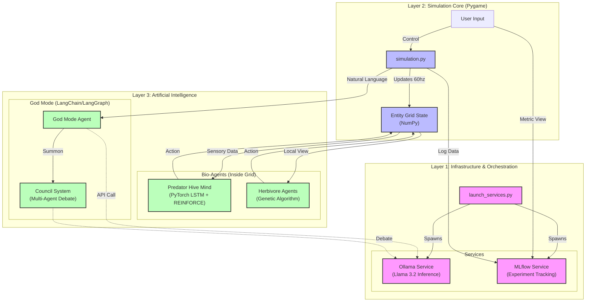

# üåç Evolving AI Biosphere

A self-evolving digital ecosystem where AI organisms fight for survival, powered by Reinforcement Learning and Genetic Algorithms.


## üìñ Overview

**Evolving AI Biosphere** is a complex artificial life simulation where organisms are not pre-programmed with rules—they **learn** how to survive.

- **Predators** share a collective "Hive Mind" (LSTM Neural Network) that evolves via Reinforcement Learning (Policy Gradient).
- **Herbivores** evolve individually via Genetic Algorithms (mutation of weights).
- **The World** is watched by an "AI God" (Ollama/Llama 3.2) that allows natural language control over the simulation.

üëâ **[Read the Full Technical Documentation](docs/index.html)** for a deep dive into the math, architecture, and evolutionary theory.

### üì∏ Demo


---

## üõ† Tech Stack

| Component | Technology | Description |
| :--- | :--- | :--- |
| **Core Engine** | Python, Pygame | Real-time simulation loop (60 FPS) and rendering. |
| **Neural Nets** | PyTorch | Custom LSTM architecture for Predator "Hive Mind". |
| **Orchestration** | Python `subprocess` | Multi-threaded service manager (`launch_services.py`). |
| **Inference** | Ollama | Local LLM serving (Llama 3.2) for God Mode control. |
| **Observability** | MLflow | Real-time experiment tracking and metric logging (Port 5001). |


---

## üß© Architecture



---

## üöÄ Installation & Setup

### Prerequisites
- **Python 3.9+**
- **Ollama** installed and running (`llama3.2` model pulled).

### 1. Clone the Repository
```bash
git clone https://github.com/alwaysvivek/evolving-ai-biosphere.git
cd evolving-ai-biosphere
```

### 2. Setup Virtual Environment
We provide a unified script to set up the environment and install dependencies:

```bash
# Make the script executable
chmod +x setup_env.sh

# Run the setup (creates venv and installs all requirements)
./setup_env.sh
```

---

## 🎮 How to Run

### Step 1: Start Background Services
This script starts **MLflow** (logging) and checks for **Ollama** (AI Brain).
```bash
python3 launch_services.py
```
*Wait until you see: `‚ú
 MLflow UI started at http://127.0.0.1:5001`*

### Step 2: Run the Simulation
Open a **new terminal tab/window**, activate the environment, and run:
```bash
source venv/bin/activate
python3 simulation.py
```

---

## 🎮 Controls

| Key | Action |
| :--- | :--- |
| **SPACE** | Pause/Resume Simulation |
| **Type** | Enter "God Mode" commands (e.g., "kill half the plants") |
| **R** | Print Console Report |
| **T** | Toggle Predator Training (ON/OFF) |
| **K** | Kill All Predators (Extinction Event) |
| **E** | Trigger Scarcity Event (Famine) |

---

## üìä Monitoring

Once the simulation starts, open **MLflow** to see live metrics including population counts, average energy, and extinction events:
üëâ **http://127.0.0.1:5001**

---

## üìú License
MIT License
